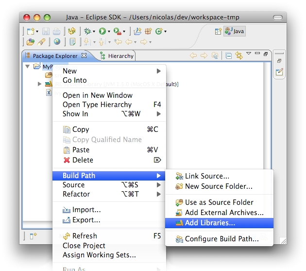
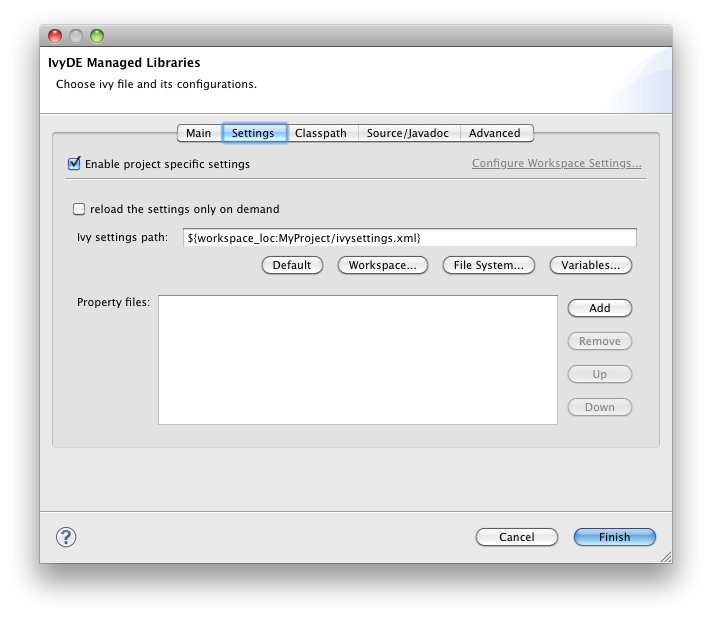

////
   Licensed to the Apache Software Foundation (ASF) under one
   or more contributor license agreements.  See the NOTICE file
   distributed with this work for additional information
   regarding copyright ownership.  The ASF licenses this file
   to you under the Apache License, Version 2.0 (the
   "License"); you may not use this file except in compliance
   with the License.  You may obtain a copy of the License at

     https://www.apache.org/licenses/LICENSE-2.0

   Unless required by applicable law or agreed to in writing,
   software distributed under the License is distributed on an
   "AS IS" BASIS, WITHOUT WARRANTIES OR CONDITIONS OF ANY
   KIND, either express or implied.  See the License for the
   specific language governing permissions and limitations
   under the License.
////

First, locate an `ivy.xml` file or a Maven `pom.xml` ready to be used to build a classpath.  Also, if necessary, locate a supporting `ivysettings.xml`.

== Fast creation

For most of the projects, the `ivy.xml` (or the `pom.xml`) file is in the Java project. So you can just right click on the `ivy.xml` and select "Add Ivy Library..." and you can directly access the prefilled setup of the IvyDE classpath container

image::../images/addivylibrary.jpg[]

== Standard creation

The standard way to add the IvyDE classpath container is to manipulate the Eclipse(TM)'s "Build Path":

* Select the project in which you want to create an IvyDE classpath container and open the "Add Libraries" form of Eclipse (in package Explorer, in the context menu of your project choose : [Build Path]/[Add Libraries]).

* Select the "IvyDE Managed Dependencies" item.

image::../images/add_lib.jpg[]

* Select an `ivy.xml` or a link:maven{outfilesuffix}[Maven `pom.xml`] file and the desired configurations.

image::../images/ivy_file_def.jpg[]

* [[localconf]]You then might want to use specific settings for your project, a configuration different from the link:../preferences{outfilesuffix}[global one]. Click on the "Enable project specific settings" check box. For additional configuration options, see the documentation about link:../eclipsevar{outfilesuffix}[Eclipse variables].

Now your classpath is set and you can see all dependencies in one unique folder of the package explorer (folder name = `ivy-file-name[conf1,conf2]`).

image::../images/cp_node.jpg[]
