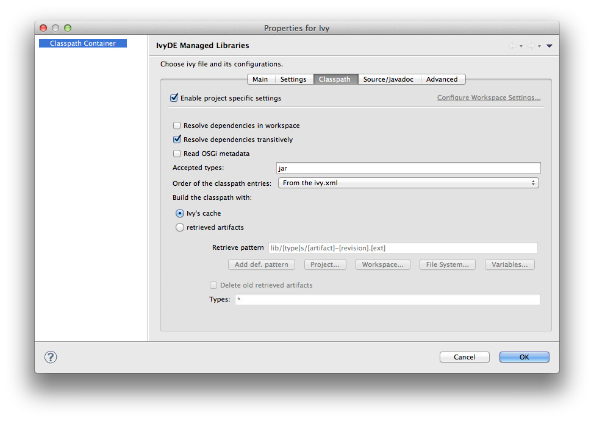

////
   Licensed to the Apache Software Foundation (ASF) under one
   or more contributor license agreements.  See the NOTICE file
   distributed with this work for additional information
   regarding copyright ownership.  The ASF licenses this file
   to you under the Apache License, Version 2.0 (the
   "License"); you may not use this file except in compliance
   with the License.  You may obtain a copy of the License at

     https://www.apache.org/licenses/LICENSE-2.0

   Unless required by applicable law or agreed to in writing,
   software distributed under the License is distributed on an
   "AS IS" BASIS, WITHOUT WARRANTIES OR CONDITIONS OF ANY
   KIND, either express or implied.  See the License for the
   specific language governing permissions and limitations
   under the License.
////

During the life of your project, you can change the `ivy.xml` file or link:maven{outfilesuffix}[Maven `pom.xml`] and change its configuration.

== Context Menu

These properties can be accessed by the context menu of the IvyDE classpath container:

image::../images/cp_configuration.jpg[]

== Build Path

You can also edit it via the *build path* configuration:

. open the build path configuration dialog, select the "Libraries" panel and select the IvyDE classpath container.
. then click on the "Edit" button: the IvyDE classpath container configuration dialog will pop up.

This is particularly useful when Eclipse hides the empty classpath containers (since Eclipse 3.3).  When the container is empty, this is the only way to trigger a resolve on this project.

