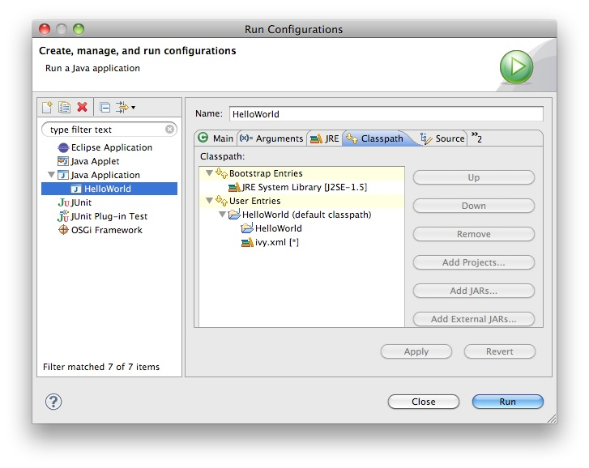
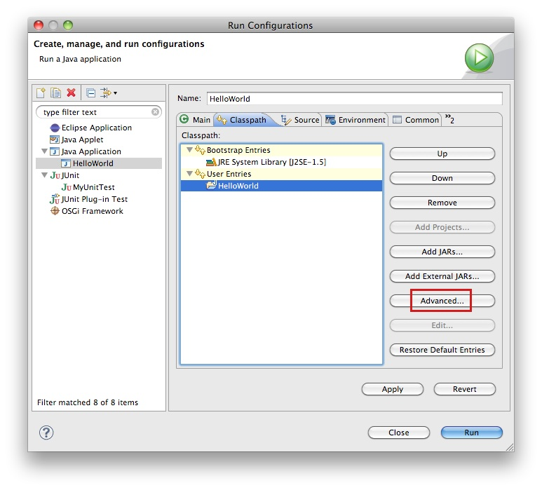
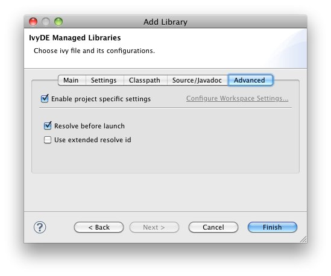
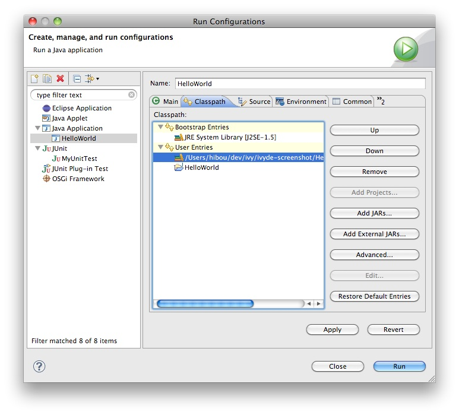

////
   Licensed to the Apache Software Foundation (ASF) under one
   or more contributor license agreements.  See the NOTICE file
   distributed with this work for additional information
   regarding copyright ownership.  The ASF licenses this file
   to you under the Apache License, Version 2.0 (the
   "License"); you may not use this file except in compliance
   with the License.  You may obtain a copy of the License at

     https://www.apache.org/licenses/LICENSE-2.0

   Unless required by applicable law or agreed to in writing,
   software distributed under the License is distributed on an
   "AS IS" BASIS, WITHOUT WARRANTIES OR CONDITIONS OF ANY
   KIND, either express or implied.  See the License for the
   specific language governing permissions and limitations
   under the License.
////

The IvyDE classpath container can also be used in the launch configuration, run or debug.

== Default behavior

By default, the container will be used because it is included in the default classpath of you project.  This is the configuration that you implicitly have when you do a "Run As..." on a Java class. The container you see in the launch classpath is the same as the one you have in your project in the package explorer.

Launching with the default the compile classpath might not be appropriate for some situations.  For example, you may have additional libraries included in the container under a configuration intended to support unit testing but that may cause some instability in the runtime application.

== Managing the classpath manually

When you do need to have finer-grained control over which configurations are visible to the runtime classpath, it is possible to edit the runtime classpath manually.

By creating a launch configuration, you will get the default classpath as described above. So the first step is to remove it. Most likely, you will want to re-add your project in the user entries. Then to add an IvyDE container, choose "Advanced":

Choose "Add Library":

image::../images/launch_addlib.jpg[]

Choose "IvyDE Managed dependencies":

image::../images/launch_addivyde.jpg[]

Select the absolute path to your `ivy.xml` file and select the proper configurations:

image::../images/launch_manualconf.jpg[]

*Note:* in the launch configuration it is not possible to edit or launch a resolve manually on the container you are creating. But it is possible to launch a resolve before each launch. It is recommended to do so if the resolve process is not too long. Otherwise you will have to recreate the container each time you change something in the `ivy.xml` file for instance.

To enable the resolve before each launch, go into the "Advanced" tab and select "Resolve before launch".

Click "Finish" and see the result:

