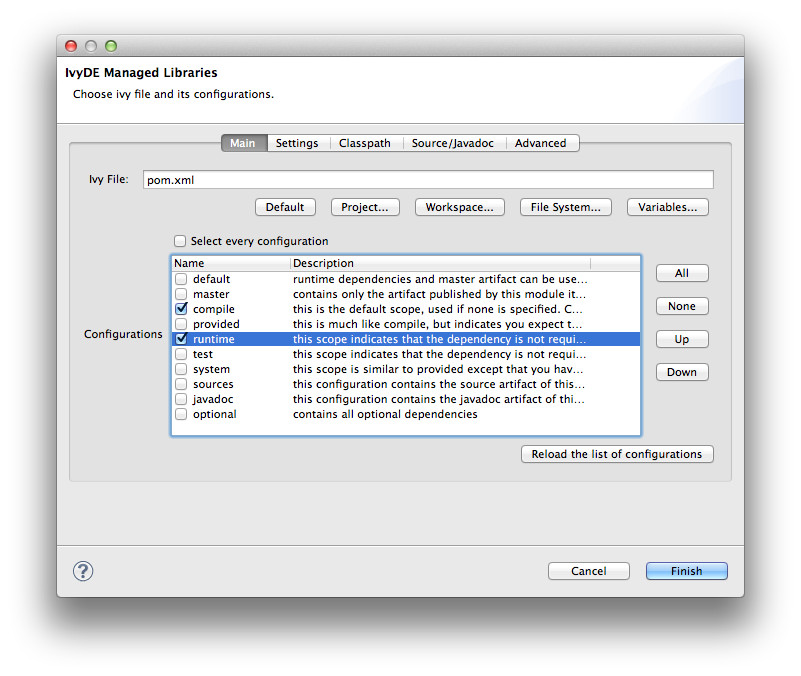
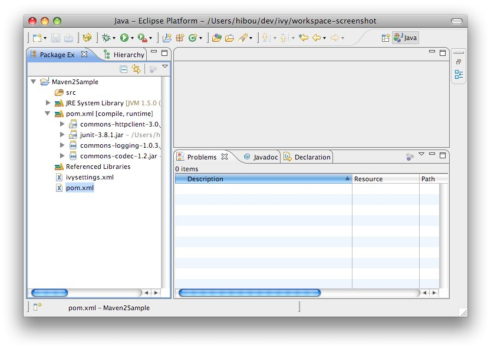

////
   Licensed to the Apache Software Foundation (ASF) under one
   or more contributor license agreements.  See the NOTICE file
   distributed with this work for additional information
   regarding copyright ownership.  The ASF licenses this file
   to you under the Apache License, Version 2.0 (the
   "License"); you may not use this file except in compliance
   with the License.  You may obtain a copy of the License at

     https://www.apache.org/licenses/LICENSE-2.0

   Unless required by applicable law or agreed to in writing,
   software distributed under the License is distributed on an
   "AS IS" BASIS, WITHOUT WARRANTIES OR CONDITIONS OF ANY
   KIND, either express or implied.  See the License for the
   specific language governing permissions and limitations
   under the License.
////

If you want to use a Apache Maven(TM) `pom.xml` instead of an `ivy.xml` file, you can select a POM file in the configuration options of the IvyDE classpath.

When a Maven POM is selected, the configurations list is updated with all Maven scopes.

Both examples below are a good illustration of the simplicity of using Maven POMs in Apache IvyDE:

* link:#one[Maven1 sample]
* link:#two[Maven2 sample]

== [[one]]Maven1 Sample

This sample presents a simple use case involving a Maven POM and the IvyDE classpath container. We are going to create an Eclipse(TM) project on commons-httpclient sources.

* Download the link:https://archive.apache.org/dist/httpcomponents/commons-httpclient/3.0/source/commons-httpclient-3.0-src.zip[commons httpclient sources]

* Unzip this file (c:/tmp/commons-httpclient/)

* Create a new Eclipse Java project based on the unzipped sources (c:/tmp/commons-httpclient/)

image::../images/httpProject_errors.jpg[]

*Note:* your project will not compile: some imports cannot be resolved.

* Add a new classpath container based on the "project.xml" POM and select "default" configuration (Maven scope)

image::../images/httpProject_pom.jpg[]

* Finished.  The project compiles!

image::../images/httpProject_clean.jpg[]

== [[two]]Maven2 Sample

This sample demonstrates how the IvyDE classpath container on a Apache Maven POM can handle transitive dependencies.

* Create a new empty Java project in Eclipse.

* In your project, create an `ivysettings.xml` file:

[source]
----
<ivysettings>
	<conf defaultResolver="ibiblio"/>
	<resolvers>
		<ibiblio name="ibiblio" />
	</resolvers>
</ivysettings>
----

Using the `m2compatible` attribute, you can benefit from Apache Maven 2 repository compatibility.

* In your project, create a `pom.xml` file:

[source]
----
<project>
	<modelVersion>4.0.0</modelVersion>
	<groupId>com.mycompany</groupId>
	<artifactId>myproject</artifactId>
	<version>1.0-SNAPSHOT</version>
	<dependencies>
		<dependency>
			<groupId>commons-httpclient</groupId>
			<artifactId>commons-httpclient</artifactId>
			<version>3.0</version>
		</dependency>
	</dependencies>
</project>
----

* On the `pom.xml` file, open the context menu and click on "Add Ivy Library...":

* Select the configurations `compile` and `runtime`

* click "Finish"

* That's all! Your IvyDE classpath container resolves all dependencies including those that were transitive to the commons-httpclient module!

