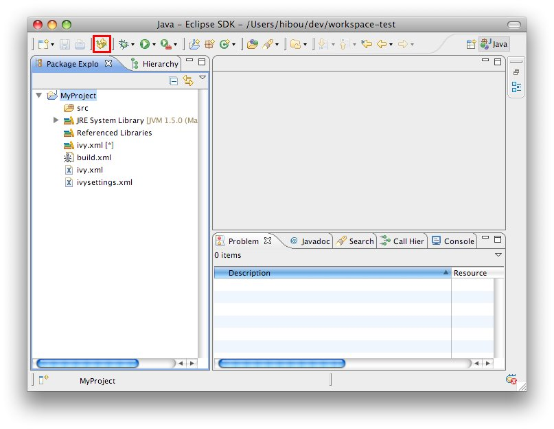

////
   Licensed to the Apache Software Foundation (ASF) under one
   or more contributor license agreements.  See the NOTICE file
   distributed with this work for additional information
   regarding copyright ownership.  The ASF licenses this file
   to you under the Apache License, Version 2.0 (the
   "License"); you may not use this file except in compliance
   with the License.  You may obtain a copy of the License at

     https://www.apache.org/licenses/LICENSE-2.0

   Unless required by applicable law or agreed to in writing,
   software distributed under the License is distributed on an
   "AS IS" BASIS, WITHOUT WARRANTIES OR CONDITIONS OF ANY
   KIND, either express or implied.  See the License for the
   specific language governing permissions and limitations
   under the License.
////

You can explicitly ask for Ivy dependency resolution from your classpath container.

This command will invoke the "resolve" Ivy task and update your classpath container.

There is also a "refresh" action: this action is similar to the resolve one, but does not perform a full resolve if a report already exists in the cache. This is particularly useful if you work with Apache Ant and a command line so that you avoid two full resolves.  It is also the default action performed on classpath containers when the Eclipse workspace is opened (*Windows > Preferences > Ivy*), in effect restoring the classpath container to its state prior to the last closing of the workspace if no other action is performed against the `ivy.xml` file in the meantime.

And there is a "reload settings" action: by default IvyDE does reload Ivy settings files each time a resolve it required. But in case the ivy settings file is remote, this take make the user experience quite slow. To work around that, you can check in the link:../preferences{outfilesuffix}[preference page] the option to only load on demand, and use the "reload settings" action in the context menu.

== Context Menu

image::../images/cp_resolve.jpg[]

== Full Refresh

You can also trigger a resolve (not a refresh!) of every IvyDE classpath container in the workspace via the button in the tool bar of Eclipse.

== Project Refresh

To launch a resolve on a specified selection of projects:

* Select the projects you want to resolve in the package view,
* Open the context menu with a right click
* Choose *Ivy > Resolve*

image::../images/resolve_contextmenu.jpg[]

