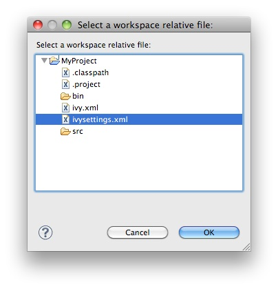

////
   Licensed to the Apache Software Foundation (ASF) under one
   or more contributor license agreements.  See the NOTICE file
   distributed with this work for additional information
   regarding copyright ownership.  The ASF licenses this file
   to you under the Apache License, Version 2.0 (the
   "License"); you may not use this file except in compliance
   with the License.  You may obtain a copy of the License at

     https://www.apache.org/licenses/LICENSE-2.0

   Unless required by applicable law or agreed to in writing,
   software distributed under the License is distributed on an
   "AS IS" BASIS, WITHOUT WARRANTIES OR CONDITIONS OF ANY
   KIND, either express or implied.  See the License for the
   specific language governing permissions and limitations
   under the License.
////

Eclipse contains a link:https://help.eclipse.org/galileo/index.jsp?topic=/org.eclipse.jdt.doc.user/reference/preferences/run-debug/ref-string_substitution.htm[string substitution mechanism]. This feature allows you to specify a path location that can be shared between developers.

Apache IvyDE uses it to find the ivysettings.xml and properties files in both the link:preferences{outfilesuffix}#settings[global preference page] and the link:cpc/create{outfilesuffix}#localconf[project specific preference page].

== Options

Using the "Workspace..." button will open a window to choose a file in the workspace. Apache IvyDE will automatically fill the field with the proper variable.

Using the "File System..." button will allow you to choose a file in the file system. This path will not be portable.

Finally, you can choose to depend on the Eclipse variable system by clicking on "Variable...".

image::images/eclipsevar_variables.jpg[]

== Backwards compatibility

Previously, Apache IvyDE supported the `project://projectName/path/to/file.ext` protocol. It sill does, but references of this style will be automatically converted in the saved settings to the Eclipse variable way of defining this path: `${workspace_loc:projectName/path/to/file.ext}.`
