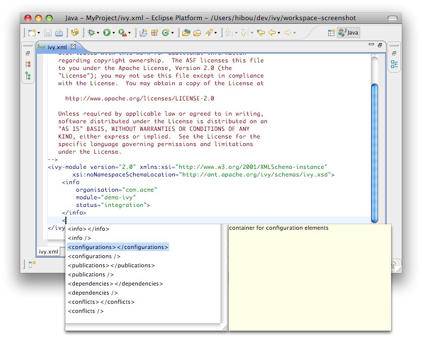

////
   Licensed to the Apache Software Foundation (ASF) under one
   or more contributor license agreements.  See the NOTICE file
   distributed with this work for additional information
   regarding copyright ownership.  The ASF licenses this file
   to you under the Apache License, Version 2.0 (the
   "License"); you may not use this file except in compliance
   with the License.  You may obtain a copy of the License at

     https://www.apache.org/licenses/LICENSE-2.0

   Unless required by applicable law or agreed to in writing,
   software distributed under the License is distributed on an
   "AS IS" BASIS, WITHOUT WARRANTIES OR CONDITIONS OF ANY
   KIND, either express or implied.  See the License for the
   specific language governing permissions and limitations
   under the License.
////

Apache IvyDE comes with an Ivy file editor that provides an editor that performs code completion for Ivy xml tags based on the real-time state of your repository.  It also packs with an Ivy file creation wizard and HTML preview.

== [[wizard]]Creation Wizard

To use the creation wizard, choose File > New > Other > IvyDE > Ivy file in the Eclipse menu (Ctrl+N by default). Select it and click Next.

image::images/wizard1.jpg[]

The wizard contains only one page, and is very simple.

image::images/wizard2.jpg[]

*Wizard fields:*
	
. Container: you must select a target project. (This is already set if you access the wizard through the context menu on your project root folder).
. File name: the Ivy file name (`ivy.xml` by default).
. Organisation: the component owner name. (your company name or the company that provides the component if you are writing an `ivy.xml` file for 3rd party jars). Note that this value can be set in the link:preferences{outfilesuffix}[Ivy preference page.]
. Module name: the component name.
. Status: the status of the project. (integration by default since we have just created its Ivy file. Please refer to the link:../../../history/latest-milestone/index.html[Ivy documentation for more details]).

== [[editor]]Ivy Editor

image::images/editor1.jpg[]

Apache IvyDE's Eclipse editor provides XML syntax coloration, tag completion, tag attribute name completion, and dependency and configuration tag value completion.

Completion comes with contextual help. The completion popup is displayed when through the CTRL + SPACE shortcut.

*Available completions:*
	
* *XML structure*: Allows you quickly to insert valid tags at the right place. If the tag can have nested children, both notations, simple tag and open tag, are proposed.
	    

	
* *Tag attributes*: When your cursor is placed in a tag bracket, the completion shows available attributes for the enclosing tag.
	    
image::images/completion2.jpg[]
	
* *Attributes values*: When your cursor is placed inside the quotes of an attribute value, the completion shows available values for the matching attribute. +
Available value completion:
** __info__: organisation (preference based), module (Eclipse project name),
** __info/ivyauthor__: name (preference based), url (pref based)
** __info/description__: homepage (pref based)
** __info/license__: name
** __info/repository__: name (the other attributes depend on it), url, ivys, pattern, artifacts
** __configurations/conf__: visibility,  deprecated, extends
** __publications/artifact__: type, conf, ext
** __dependencies/dependency__: org, name, rev are resolved thanks to Ivy using the settings configured in the link:cpc/edit{outfilesuffix}[project Ivy preference page]. If not set to "default" Ivy uses its default resolver configuration (i.e. ivyrep + ibiblio), and if these are not set Ivy uses the settings configured in the link:preferences{outfilesuffix}[Eclipse Ivy preference page]. conf values are computed from the current `ivy.xml` file and the dependency `ivy.xml` file if any.

image::images/completion4.jpg[]

* *Change colors:* you can change the color used by the editor in the link:preferences{outfilesuffix}#xmleditor[global preferences page].
