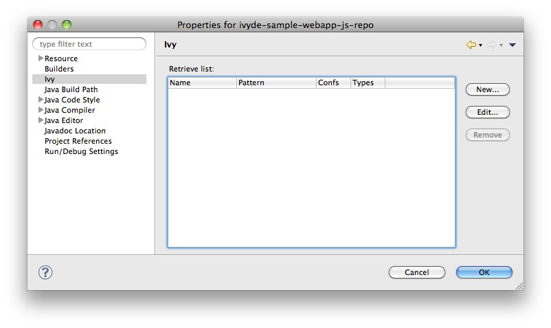

////
   Licensed to the Apache Software Foundation (ASF) under one
   or more contributor license agreements.  See the NOTICE file
   distributed with this work for additional information
   regarding copyright ownership.  The ASF licenses this file
   to you under the Apache License, Version 2.0 (the
   "License"); you may not use this file except in compliance
   with the License.  You may obtain a copy of the License at

     https://www.apache.org/licenses/LICENSE-2.0

   Unless required by applicable law or agreed to in writing,
   software distributed under the License is distributed on an
   "AS IS" BASIS, WITHOUT WARRANTIES OR CONDITIONS OF ANY
   KIND, either express or implied.  See the License for the
   specific language governing permissions and limitations
   under the License.
////

Ivy is a generic dependency manager and can manipulate jars as well as any other kind of resources. IvyDE leverages this feature by bringing dependency management to non Java Eclipse projects.

In this document we will document how to work with IvyDE and non Java dependencies with a concrete example: we will manage the dependencies between some JavaScript files and bring them into a Java webapp.

== Import the sample project into Eclipse

The full project sample can be downloaded from link:sample/webapp-js-repo.zip[there]. Unzip it somewhere and import it into Eclipse (see "Existing Projects into Workspace" in the "Import" menu).

The Eclipse project is already configured with an IvyDE classpath container so we can run the Java webapp. We will just have to add the retrieve of the JavaScript files.

== [[configure]]Configure the non-Java dependencies

=== [[configure-nature]]Configure the Ivy nature

In order to manage dependencies with Ivy, it is required for the Eclipse project to have the "Ivy" nature.

In the sample project, an Ivyde classpath container is already configured, so the Eclipse project already has the "Ivy" nature.

In case your project doesn't has it, right click on the project and in the menu "Configure" select "Add Ivy dependency management".

image::images/add_ivy_nature.jpg[]

=== [[configure-retrieve]]Add a retrieve setup

Now that the project has the Ivy nature, a new entry should have appeared in the properties of your project. This is where non Java dependencies are managed.

Now select "New..." to create a retrieve setup.

image::images/retrieve_setup.jpg[]

.Name

It gives a human readable name to the retrieve setup. This name will be used later in the context menu to actually launch a retrieve of the dependencies.
For the sample project, let's choose "javascripts".

.Ivy file

The Ivy file which declares the dependencies to retrieve.
For the sample project, we will use the same one has the one which is used for the Java dependencies (it is not required).

.Retrieve pattern

It defines where the dependencies should be retrieved.
For the sample project we want them there: `src/org/apache/ivyde/sample/webappjsrepo/js/[artifact]-[revision].[ext]`.

.Delete old retrieved artifacts

Before doing a retrieve, the location where the dependencies are downloaded will be wiped out is this option is selected.

.Configurations

This is a comma separated list of configuration names which will be used for the resolve ('`$$*$$`' means __All__).
For the sample project, we want it to be `js`.

.Types

This is a comma separated list of type names which is be retrieved ('`$$*$$`' means __All__).
For the sample project, we want them all: '`$$*$$`'.

Now in the "Settings" tab, the setup entries are the same as the link:preferences{outfilesuffix}#settings[global ones]. Click on "Enable project specific settings" to customize for your setup.

image::images/retrieve_setup_settings.jpg[]

For the sample project, we want to use the Ivy settings in the Java project: `${workspace_loc:ivyde-sample-webapp-js-repo/ivysettings.xml}`.

Finally, click *OK* to finish.

== Launch a retrieve

Now that the retrieve is set up, a new entry should be available in the "Ivy" context menu. The menu entry should be "Retrieve 'xxx'" where "xxx" is the name you gave to the retrieve setup. For the sample project, it will be "Retrieve 'javascripts'".

Select the entry to actually launch the retrieve. The Eclipse project gets automatically refreshed with the retrieved files. For the sample project look into `src/org/apache/ivyde/sample/webappjsrepo/js/jquery-1.7.1.min.js`.

image::images/launch_standalone_retrieve.jpg[]

== Launch the sample webapp

To see the result, we'll launch the Java webapp and look at it in your browser locally.

Right click the Java class `org.apache.ivyde.sample.webappjsrepo.HTTPServer` and select "Run As" / "Java Application".
Now open the web page http://localhost:8888/index.html
If working properly, the JavaScript files should have been loaded and the input field should have automatically been filled with a default value.

image::images/webapp-js-repo-launch.jpg[]
