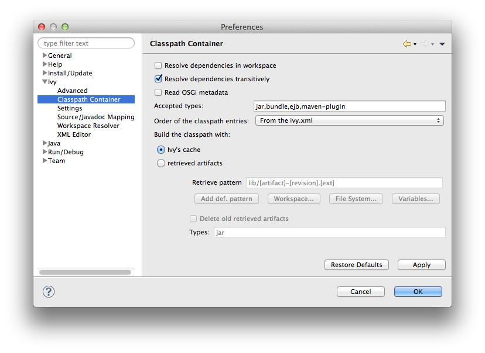

////
   Licensed to the Apache Software Foundation (ASF) under one
   or more contributor license agreements.  See the NOTICE file
   distributed with this work for additional information
   regarding copyright ownership.  The ASF licenses this file
   to you under the Apache License, Version 2.0 (the
   "License"); you may not use this file except in compliance
   with the License.  You may obtain a copy of the License at

     https://www.apache.org/licenses/LICENSE-2.0

   Unless required by applicable law or agreed to in writing,
   software distributed under the License is distributed on an
   "AS IS" BASIS, WITHOUT WARRANTIES OR CONDITIONS OF ANY
   KIND, either express or implied.  See the License for the
   specific language governing permissions and limitations
   under the License.
////

Apache IvyDE maintains a global configuration, which controls the behaviour of every Ivy instance in every project in the workspace. This global configuration can be overridden in each link:cpc/edit{outfilesuffix}[project].

The global configuration can be found in the preferences of Eclipse (menu Window > Preferences for Windows and Linux users, Eclipse > Preferences for mac users), and select the item Ivy.

== [[global]]Global Ivy preferences

image::images/pref.jpg[]

.Offline

If checked, it will force Ivy to never check resources via any network and trust its cache

.Open the Ivy console on startup

If checked, the Ivy console will be opened on startup so that every log from Ivy will be printed. This is especially useful when looking for debug log from IvyDE starting up.

.On Eclipse startup:

Specifies what Apache IvyDE should do in every project containing an IvyDE managed classpath container when Eclipse(TM) is starting up.

.On Ivy file change:

Controls whether a resolve is performed each time Eclipse detects a change on an `ivy.xml` file configured by an IvyDE container via a save in the editor, a refresh, or a team/update.

.Organisation:

Your company name for Ivy editor completion.

.Organisation URL:

Your company web site url for Ivy editor completion.

.Open a popup on each failed resolve

On a resolve error, IvyDE mark an error on the `ivy.xml` file of the project; if checked it will also open a popup with a detailed error message

== [[advanced]]Advanced

image::images/pref_advanced.jpg[]

.Resolve before launch:

An IvyDE container can be used in the classpath of a launch configuration, and the container can be resolved on each launch. See the documentation about link:cpc/launch{outfilesuffix}[launch configurations] for further information on this feature.

.Use extended resolve id

A resolve id is an identifier which helps Ivy to make cache of results of resolve. By default IvyDE each the id which is composed of the organisation and the module name. An extended resolve id is also composed of the status, branch and revision. If you have troubles with the resolve of multiple versions of the same project within the same workspace, you should probably enable this option.

== [[classpath]]Classpath container

.Resolve dependencies in workspace:

Apache IvyDE allows Ivy dependencies between projects in the workspace to be realized through project references rather than jars from the repository.  See the link:cpc/workspace{outfilesuffix}[documentation] for further information on this feature.

.Resolve dependencies transitively

If unchecked, the dependencies will be resolved with transitivity disabled regardless to the settings in `ivy.xml` file

.Read OSGi metadata:

If your classpath is based on jars which are actually OSGi bundles, checking this option will make IvyDE read the jar manifests and set up the specific OSGi visibility constraints.

.Accepted types:

A comma separated list of extensions which will make IvyDE add the artifact to the classpath. Setting `*` will make very kind of type accepted. Note that a type specified as a link:#mapping[source or javadoc type] won't be accepted in any manner.

.Order of the classpath entries:

By default, the classpath container entries are ordered by order of declaration in the `ivy.xml` file. When there are many entries, it can be useful to have them ordered lexically for enhanced readability.

.Build the classpath with:

Either Ivy with build a classpath with references to the artifacts in its cache.

Or Ivy will retrieve the artifacts with the specified pattern, and then build a classpath with the retrieved jars.
  
* Retrieve pattern: The pattern to use for the retrieve. Check link:../../../history/latest-milestone/use/retrieve.html[Ivy documentation] for pattern explanation.    
* Delete old retrieve artifacts: On each retrieve, the previously retrieved libraries will be removed (similar to the sync argument in the Ant task).
* Types: The types of artifact to retrieve (a comma separated list)

== [[settings]]Ivy settings

image::images/pref_settings.jpg[]

.Reload the settings only on demand:

By default, Apache IvyDE will parse the Ivy settings file each times it is needed (each resolve, refresh, clean cache or completion in the Ivy editor). For remote Ivy settings this can slow the UI dramatically, so it is possible to make IvyDE keep the settings in a cache and only reload them via the context menu on the container).

.Ivy settings path:

The path to your Ivy settings file. Leave it blank to use Ivy default resolvers. See also the documentation about link:eclipsevar{outfilesuffix}[Eclipse variables].

.Ivy user dir:

The path to the default Ivy user directory, where Ivy have its default cache location

.Property files:

This is a list of Java properties files to load before loading the ivysettings.xml. Specify in this files properties which you expect to use in the ivysettings.xml

== [[mapping]]Source/Javadoc mapping

image::images/pref_source_javadoc_mapping.jpg[]

.Sources types:

A comma separated list of Ivy "type" names which should be considered sources.

.Sources suffixes:

A comma separated list of suffixes which will make IvyDE attach as source the artifact with the suffix to the artifact without the suffix. For instance, "commons-lang-sources.jar" will be attached as source to "commons-lang.jar" with the default value.

.Javadoc types:

same as sources types but for javadocs

.Javadoc suffixes:

same as sources suffixes but for javadocs

.Auto map jar artifacts with unique source artifact

If checked, in case there is only one artifact which is detected of type source, then IvyDE will consider this artifact the source of every jar of the module

.Auto map jar artifacts with unique javadoc artifact

Same as above but with javadoc

For further information on how the mapping works, checkout this link:cpc/jarmapping{outfilesuffix}[specific documentation].

== [[workspace]]Workspace resolver

image::images/pref_workspace.jpg[]

.Closing trigger resolve:

Closing a project which has the workspace resolver enabled will trigger a resolve on every project that depends on it.

.Opening trigger resolve:

When a project is opened, IvyDE will trigger the resolve of every other project which has the workspace resolver enabled.

.Ignore version when resolving workspace projects:

This option forces the workspace resolver to ignore the version of a module specified in an `ivy.xml` file if a project containing an Ivy file with that module organization and name is found in the workspace, instead substituting a project reference.  This may have unintended consequences.

For further information on how the workspace resolver works, checkout this link:cpc/workspace{outfilesuffix}[specific documentation].

== [[xmleditor]]XML Editor

This configuration panel allow you to change the color used in the link:ivyeditor{outfilesuffix}[Ivy file editor] and the link:settingseditor{outfilesuffix}[Ivy settings editor].

image::images/xml_editor_color.jpg[]
