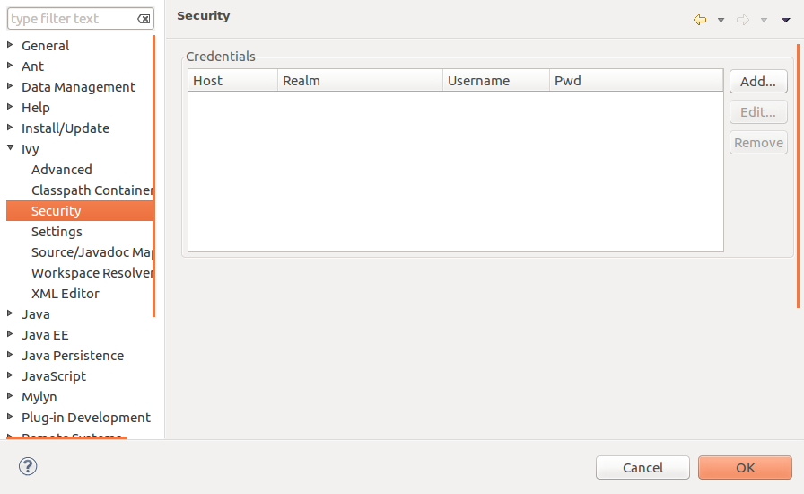
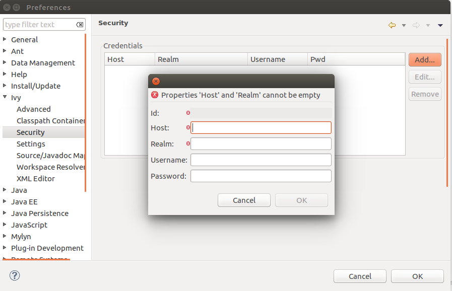
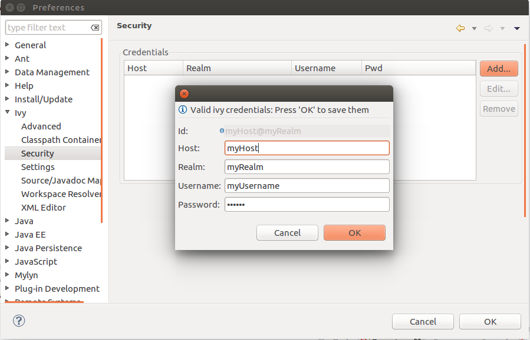
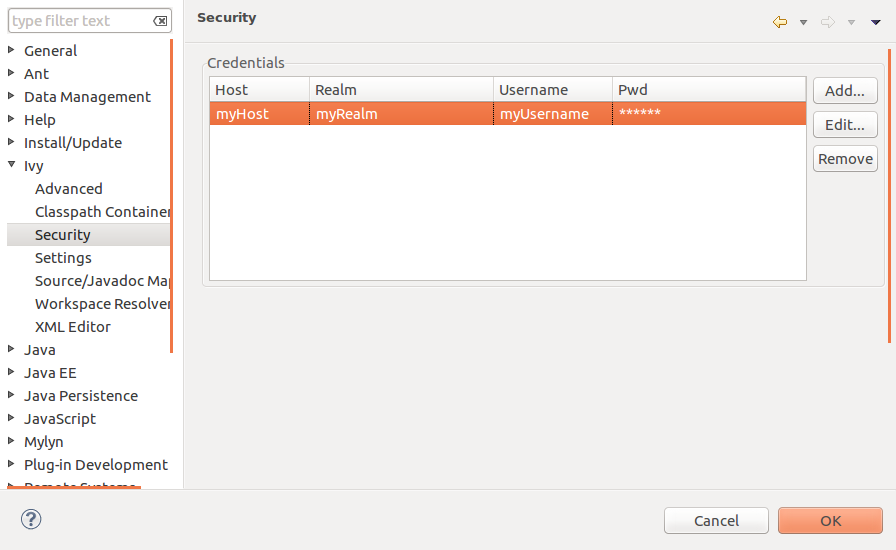
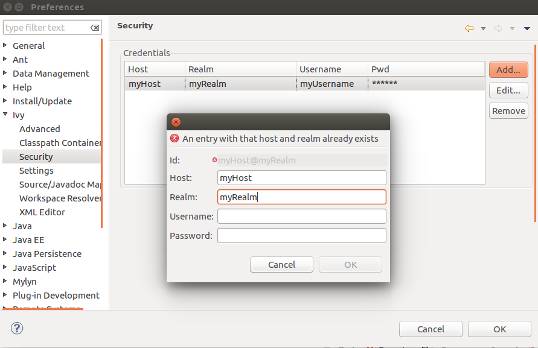
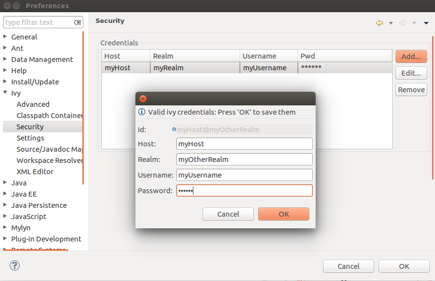
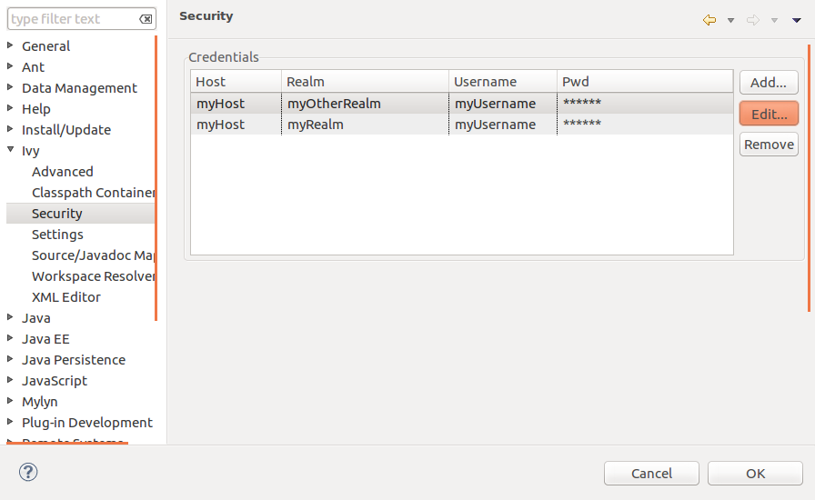
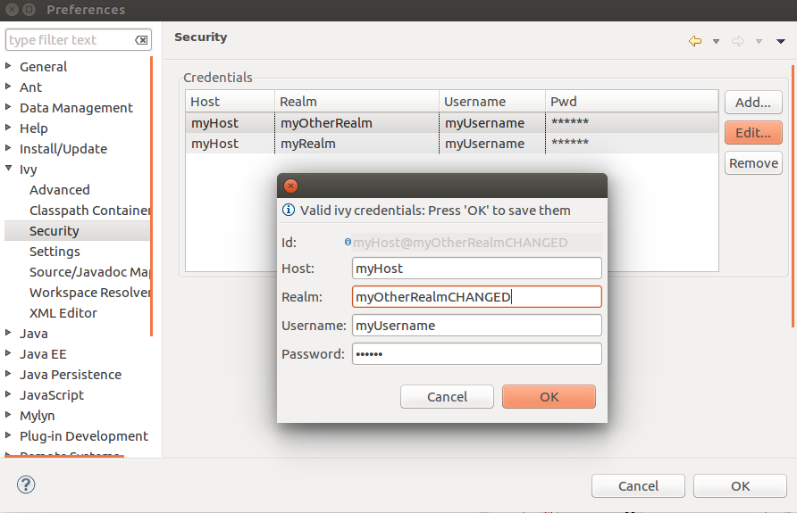
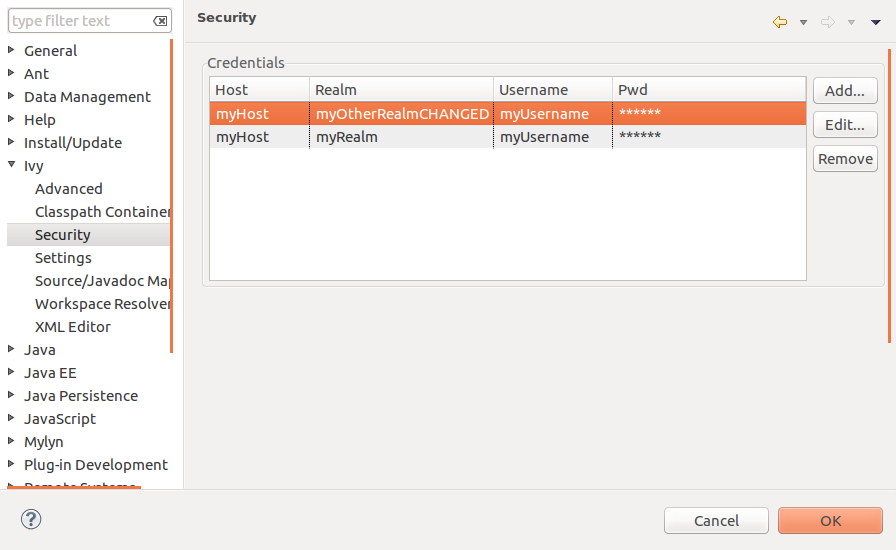
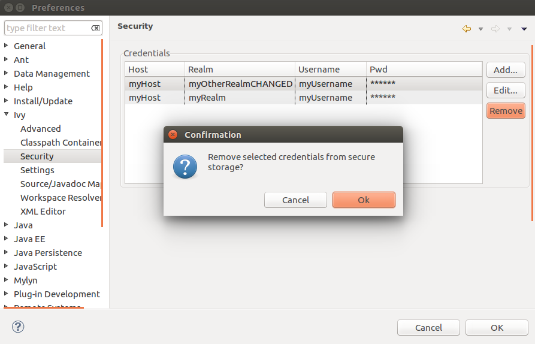

////
   Licensed to the Apache Software Foundation (ASF) under one
   or more contributor license agreements.  See the NOTICE file
   distributed with this work for additional information
   regarding copyright ownership.  The ASF licenses this file
   to you under the Apache License, Version 2.0 (the
   "License"); you may not use this file except in compliance
   with the License.  You may obtain a copy of the License at

     https://www.apache.org/licenses/LICENSE-2.0

   Unless required by applicable law or agreed to in writing,
   software distributed under the License is distributed on an
   "AS IS" BASIS, WITHOUT WARRANTIES OR CONDITIONS OF ANY
   KIND, either express or implied.  See the License for the
   specific language governing permissions and limitations
   under the License.
////

This preference section allows you to manage credentials, which the Ivy dependency manager needs to access protected repositories. The credentials are directly stored into the Eclipse Secure storage and loaded during the IvyDE-plugin's startup. This preference page allows you to manage your Ivy credentials safely without the need to "publish" them in plain-text inside your build-files.

== [[general]]General workflow

The IvyDE credentials extension allows you - as already mentioned - to protect your Ivy credentials by using the Eclipse Secure storage. The credential entries are only maintained by the Eclipse secure storage itself: Every operation (add/edit/remove) is directly performed on the Eclipse secure storage without any intermediate caches. At the IvyDE plugin's startup, the Eclipse Secure storage is accessed (this operation requires you to insert your password if your Eclipse Secure storage is password-protected) and all the credential entries - which are related to the Ivy dependency manager - are loaded and copied to the internal Ivy credential manager (where Ivy looks for credentials in case of protected repositories).

Please note that this "credential-copying" is directly done after the IvyDE plugin's startup. If your Ivy settings files, respectively, your buildfiles also contain credentials pointing to the same repository (same host@realm combination as already stored in the Eclipse Secure storage), the credentials inside the Eclipse Secure storage may be overwritten due to the fact that credentials specified within the mentioned alternative locations may be added to the internal Ivy credential manager after the "credential copying" was performed.

== [[credentialsOverview]]Overview

In this view all your credentials related to the Ivy dependency manager are listed. The credentials consist of:

* Host: The host of your protected repository.

* Realm: The realm of your protected repository.

* Username: The username which grants access to the protected repository.

* Pwd: The password to identify yourself.

You can either add new credentials or edit/remove existing ones (see next sections).

== [[addCredentials]]Add new credentials

Click on the "Add..." button to add new credentials:

A new dialog appears where you can insert a new credential entry. The properties "Host" and "Realm" are required because they are used to identify an artifact repository and thus also a credential entry within the Eclipse secure storage. The property "Id" is read-only and shows you the repository's identifier (host@realm).

If the inserted host@realm combination is unique and does not already exist, the credential entry can be saved (stored directly to the Eclipse Secure storage). Press "OK" to save, "Cancel" otherwise.

The added credential entry is now visible within the overview and can be edited or removed:

Adding a new credential entry having the same identifier is not permitted (as mentioned before):

The Ivy dependency manager allows multiple repositories for the same host, but their realm has to be unique on that host:

== [[editCredentials]]Edit existing credentials

Once credentials are added to the Eclipse Secure storage, they can be edited. To edit a credential entry, select the desired entry (row) listed in the overview and press "Edit...":

Afterwards the edit dialog appears. Press "OK" to save your changes or "Cancel" to discard your changes:

If you saved your changes, the credential entry inside the Eclipse Secure storage is updated and the credential overview is refreshed:

== [[editCredentials]]Remove existing credentials

In the credentials overview press "Remove" to delete the selected credential entry. Press "OK" to confirm or "Cancel" to abort the operation:

Please note that the internal IvyDE credentials manager (currently) does not permit removal of credentials once they are loaded at startup. If you delete credentials entries, the corresponding entries in the internal IvyDE credentials manager are invalidated (password and username are nulled). After Eclipse is restarted, the the internal IvyDE credentials manager is rebuild.